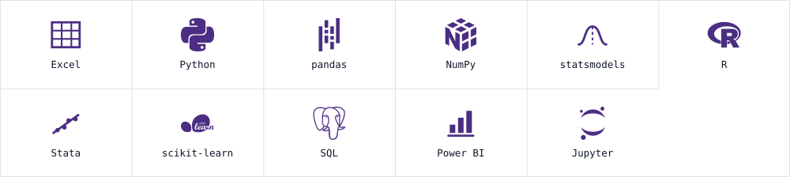
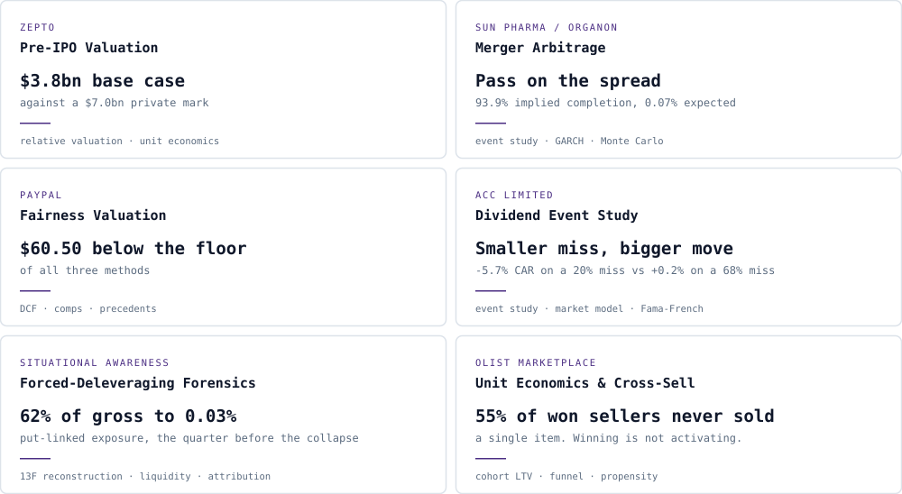

<picture><source media="(prefers-color-scheme: dark)" srcset="assets/dark/header.svg"/></picture>

<a href="mailto:shaswatsharma.work@gmail.com"><picture><source media="(prefers-color-scheme: dark)" srcset="https://img.shields.io/badge/EMAIL-0d1117?style=flat-square&logo=maildotru&logoColor=ffffff"/></picture></a>
<a href="https://www.linkedin.com/in/shaswatsharma49"><picture><source media="(prefers-color-scheme: dark)" srcset="https://img.shields.io/badge/LINKEDIN-0d1117?style=flat-square&logo=linkedin&logoColor=ffffff"/></picture></a>

<picture><source media="(prefers-color-scheme: dark)" srcset="assets/dark/toolkit.svg"/></picture>

<picture><source media="(prefers-color-scheme: dark)" srcset="assets/dark/s-work.svg"/></picture>

<picture><source media="(prefers-color-scheme: dark)" srcset="assets/dark/showcase.svg"/></picture>

<table>
<tr><td width="100%">

### [Zepto — Pre-IPO Valuation](https://github.com/theshaswat/zepto-pre-ipo-valuation)

**$3.8bn base case against a $7.0bn private mark.** Built before the roadshow range was consulted; the resulting $2.7–5.5bn range brackets what institutions actually indicated ($3.0–3.5bn domestic, $4.5bn foreign).

Zepto, Blinkit and Instamart disclose on three incompatible bases — 1P inventory against 3P commission — making headline revenue comparisons wrong by roughly 4.3x. Restated onto net order value, the binding constraint was never store density: Zepto runs the highest orders per store per day of the three (1,618) and the weakest basket (₹388, against ₹518 and ₹508). About 4 percentage points of the headline cut is rupee depreciation rather than fundamentals.

`relative valuation` `unit economics` `scenario & sensitivity` `fx decomposition` `Excel` `Python` `pandas`

</td></tr>
<tr><td width="100%">

### [Sun Pharma / Organon — Merger Arbitrage](https://github.com/theshaswat/sunpharma-organon-merger-arbitrage)

**Pass on the spread.** Standalone DCF puts Organon at $6.90 against a $14.00 offer — $1.86bn of synergy management never disclosed, requiring 3.87% revenue growth against an actual −0.38% two-year CAGR.

The spread implies 93.9% completion probability. A seeded 100,000-path Monte Carlo returns a mean annualised 0.07% against a 4.62% risk-free rate: the position is not paid for the risk it carries. Sun Pharma's own announcement CAR was +9.6% and statistically significant, which is the evidence that cuts hardest against the standalone valuation.

`DCF & reverse-DCF` `event study` `GARCH(1,1)` `Granger causality` `Monte Carlo` `Black-Scholes` `statsmodels`

</td></tr>
<tr><td width="100%">

### [PayPal — Fairness Valuation vs. the Stripe/Advent Bid](https://github.com/theshaswat/paypal-stripe-advent-ma-valuation)

**$60.50 sits below the floor of all three methods.** DCF bear case $73.85, trading comps $76.69, precedent-transaction floor $64.88. Making the base case agree with the offer requires a 13.4% discount rate against a calculated 9.67% WACC.

A reverse DCF makes the same point from the other side: the $47.37 unaffected close implies ~17%, or five straight years of −11.6% revenue decline — neither consistent with reported results or guidance. That reads the pre-news price as a sentiment floor, not an intrinsic-value anchor.

`DCF` `trading comps` `precedent transactions` `sources & uses` `football field` `Excel` `Python`

</td></tr>
<tr><td width="100%">

### [ACC Limited — Dividend vs. Earnings Event Study](https://github.com/theshaswat/acc-dividend-event-study)

**A 68% profit miss moved the stock less than a 20% miss did the year before.** Same Rs 7.50 dividend, bundled with results both times — the reaction tracked the surprise, not the size of the miss.

FY25's decline arrived with no precedent and produced a significant, lasting −5.7% three-day CAR (market model), −5.8% under Fama-French three-factor. FY26's much larger decline had been signalled for months; its −3.0% initial reaction had fully reverted to +0.2% within two weeks — consistent with the cost pressure being priced in ahead of the print.

`event study` `market model` `Fama-French 3-factor` `Brown-Warner t-test` `Python` `statsmodels`

</td></tr>
</table>

<picture><source media="(prefers-color-scheme: dark)" srcset="assets/dark/s-method.svg"/></picture>

One registry holds every externally-sourced figure, tagged by provenance tier; nothing else
contains a typed-in number, so the memo, the notebooks, the deck and the model cannot drift
apart. Each repository carries its own verification suite and runs it in CI on every push — the
Zepto build rebuilds all nine notebooks, the deck, the PDFs and the workbook from source and
re-audits the result, and the PayPal build asserts every committed output still reproduces
byte-for-byte. Primary sources are pinned by SHA-256 rather than redistributed, so a reader can
prove they hold the same document the figures were read from.

Limitations are written down rather than omitted, including corrections made mid-analysis where
an earlier draft was wrong. Two of the three recorded in the Zepto memo are errors a reader
working from secondary coverage would reproduce.

<picture><source media="(prefers-color-scheme: dark)" srcset="assets/dark/s-next.svg"/></picture>

Work in progress extends the same standard to a wider toolset: SQL-backed pipelines so the
registry is queried rather than typed, econometric work carried in R and Stata alongside Python,
and a reporting layer in Power BI. Each ships with the same verification suite and the same
written limitations as the three above.

Independent research. Not investment advice.
